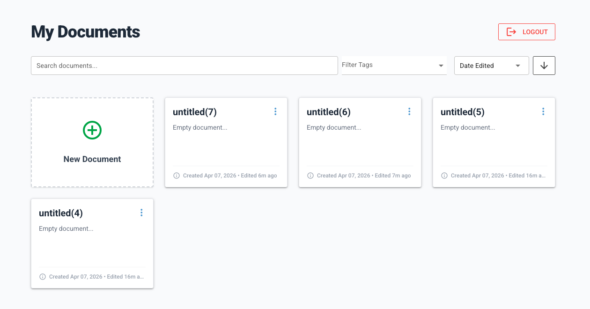

# Notely



A web-based Markdown note-taking app with tagging, search, sorting, PDF export, and OAuth 2.0 authentication via AWS Cognito. Built with [NiceGUI](https://nicegui.io) and served as a self-hosted web server.

## Table of Contents

- [Features](#features)
- [Prerequisites](#prerequisites)
- [Usage](#usage)
  - [Run directly from GitHub](#run-directly-from-github)
  - [Run after cloning](#run-after-cloning)
  - [CLI options](#cli-options)
  - [Run with Docker Compose](#run-with-docker-compose)
- [Authentication](#authentication)
- [Development](#development)
  - [Setup](#setup)
  - [Building](#building)
  - [Testing](#testing)
  - [Formatting](#formatting)
  - [Clean](#clean)

## Features

- Create, edit, and delete Markdown notes in a browser UI
- Tag notes and filter by tag
- Full-text search and sorting (by date edited, date created, or name)
- Export notes to PDF
- OAuth 2.0 login flow backed by AWS Cognito
- Notes stored as plain `.md` files with YAML front-matter — no database required
- Docker Compose support for one-command deployment

## Usage

Once the server is up, open http://localhost in your browser.

### CLI options

```
notely server start [DIRECTORY] [OPTIONS]

Arguments:
  DIRECTORY          Path to the notes folder (default: ~/Documents/Notely)

Options:
  -p, --port INT     Port to listen on (default: 80)
  -d, --default-name TEXT  Default filename for new notes (default: untitled)
```


### Run using uv

Install [`uv`](https://docs.astral.sh/uv/getting-started/installation/#installation-methods) (Python ≥ 3.14 required).

```bash
git clone https://github.com/harish-prem/Notely.git
cd Notely
uv run notely server start
```

### Run with Docker Compose

Notely ships with a `compose.yaml` for containerised deployment. Notes are persisted in a local `./notes` volume.

1. Copy `auth.env` and fill in your OAuth credentials (see [Authentication](#authentication)).
2. Start the service:

```bash
docker compose up
```

The app will be available at http://localhost:80.

## Authentication

Notely uses OAuth 2.0 (Authorization Code flow) with AWS Cognito. Create an `auth.env` file in the project root with the following variables:

```env
LOGIN_ENDPOINT=https://<your-cognito-domain>/login
TOKEN_ENDPOINT=https://<your-cognito-domain>/oauth2/token
REVOKE_ENDPOINT=https://<your-cognito-domain>/oauth2/revoke
USERINFO_ENDPOINT=https://<your-cognito-domain>/oauth2/userInfo
HOST_ENDPOINT=http(s)://<notely-domain>/
CLIENT_ID=<your-app-client-id>
CLIENT_SECRET=<your-app-client-secret>
```

The redirect URI registered in your Cognito app client must be `<HOST_ENDPOINT>/oauth2/authorize_response`.

[!IMPORTANT]
Never commit or share your `auth.env`.

## Development

### Setup

```bash
uv run poe setup
```

This runs `uv sync --all-groups` to install all dependencies including dev and lint extras.

### Building

#### Wheel

```bash
uv build
```

Produces a `.whl` file suitable for distribution via `uvx`.

#### Standalone executable

Requires one of the [C compilers supported by Nuitka](https://github.com/Nuitka/Nuitka?tab=readme-ov-file#c-compiler).

```bash
uv run poe build
```

### Testing

```bash
uv run pytest
```

Tests run in parallel across all available CPU cores via `pytest-xdist`.

### Formatting

```bash
uv run poe format          # format entire project
uv run poe format -- path  # format a specific path
```

### Clean

Remove all temporary and generated files:

```bash
uv run poe clean
```
